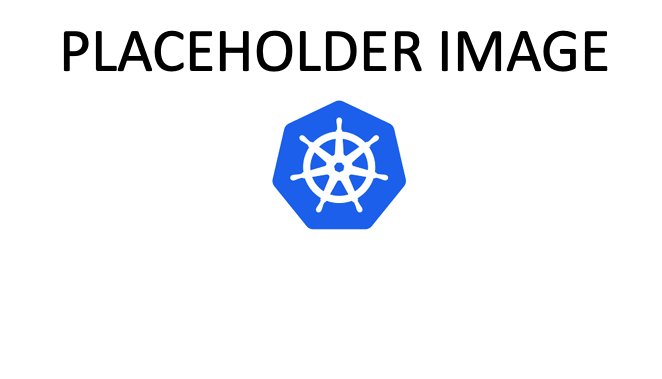

= Archetype: Azure Kubernetes Services (AKS) architecture
:toc:
:toc-placement: auto
:toclevels: 2

This archetype is based on the https://docs.microsoft.com/azure/architecture/guide/architecture-styles/aks[AKS application] reference architecture using Azure Kubernetes Services (AKS). The archetype deploys a single AKS cluster to host linux based containerized workloads.

== Create your archetype configuration file

The toolkit provides an example configuration file for the AKS environment. You will need to create a new version of this file before running your deployment.

1. Navigate to the toolkit's link:../../../archetypes/aks[archetypes/aks] folder.
1. Make a copy of the `archetypes.test.json` and name the copy `archetypes.json`.
1. Edit `archetypes.json` providing the subscription, organization, networking, and other configuration information that you want to use for your deployment. You will need to use some of the same values when creating the configuration for the shared services environment.

If your copy of the toolkit is associated with the git repository, the link:../../../.gitignore[.gitignore] file is set to prevent your deployment `archetypes.json` file from being pushed to your code repository.

Modifications to the `archetypes.json` are required in order to successfully deploy the archetype. The following table describes the minimum modifications required to deploy under default conditions. Additional modifications can be made, but are not covered in this article. 

[options="header",cols="a,,"]
|===
| Parameter | Constraint | Description

| `${general.organization-name}`
| Unique per Subscription
| Used to construct resourece names for resources deployed in this archetype. 

| `${general.tenant-id}`
| Globally Unique
| Tenant ID for Azure Active Directory (AAD) Tenant managing the Subscription where the archetype is being deployed. 

| `${general.deployment-user-id}`
| Unique to AAD Tenant
| AAD user ID for user deploying the archetype. 

| `${general.vdc-storage-account-name}`
| Regionally Unique
| Storage Account for configuration files and parameters used during deployment.

| `${general.vdc-storage-account-rg}`
| Unique per Subscription
| Resource Group for the previously defined Storage Account.

| `${general.on-premises}`
| N/A
| Parameters must match the deployment parameters for the on-premises resources.

| `${general.shared-services}`
| N/A
| Parameters must match the deployment parameters for the shared services archetype.

| `${general.workload.deployment-name}`
| N/A
| Name assigned to the deployment of this archetype (for reference and troubleshooting).

| `${general.workload.subscription-id}`
| Globally Unique
| Subscription ID where the archetype will be deployed.

| `${general.workload.region}`
| N/A
| Azure Region to deploy the archetype.

| `${general.workload.kubernetes.service-principal-client-id}`
| Unique to AAD Tenant
| Service Principle ID used to deploying the AKS cluster. This ID must have ***NEED TO DEFINE APPROPRIATE PERMISSIONS***.

| `${general.workload.kubernetes.service-principal-client-secret}`
| N/A
| Secret for the previously created AAD service principal.

| `${general.workload.kubernetes.rbac-server-appid}`
| Unique to AAD Tenant
| ID for server application created for integration with Azure AD. A reference for creating this identity can be found https://docs.microsoft.com/en-us/azure/aks/aad-integration#create-server-application[here]. 

| `${general.workload.kubernetes.rbac-server-secret}`
| N/A
| Secret for the previously created AAD server application.

| `${general.workload.kubernetes.rbac-client-appid}`
| Unique to AAD Tenant
| ID for client application created for integration with Azure AD. A reference for creating this identity can be found https://docs.microsoft.com/en-us/azure/aks/aad-integration#create-client-application[here]. 

| `${general.workload.kubernetes.rbac-tenant}`
| Globally Unique
| AAD Tenant integrated with AKS for kubernetes RBAC authentication. A reference can be found https://docs.microsoft.com/en-us/azure/aks/aad-integration[here]. 

| `${general.workload.kubernetes.aks-cluster-admin-rbac-role-id}`
| Unique to AAD Tenant
| ***NEED DETAILS***. 

| `${general.workload.kubernetes.aks-cluster-user-rbac-role-id}`
| Unique to AAD Tenant
| ***NEED DETAILS***.

| `${general.workload.kubernetes.reader-rbac-role-id}`
| Unique to AAD Tenant
| ***NEED DETAILS***. 

| `${general.workload.kubernetes.cluster-admin-group-id}`
| Unique to AAD Tenant
| Cluster Admin persona AAD group in the RBAC Tenant (used to manage group membership). A description of each persona can be found below in the AKS archetype description. 

| `${general.workload.kubernetes.noc-user-group-id}`
| Unique to AAD Tenant
| NOC persona AAD group in the RBAC Tenant (used to manage group membership). A description of each persona can be found below in the AKS archetype description. 

| `${general.workload.kubernetes.dev-user-group-id}`
| Unique to AAD Tenant
| Developer persona AAD group in the RBAC Tenant (used to manage group membership). A description of each persona can be found below in the AKS archetype description. 
|===

== AKS Archetype description

An overview diagram of the resources deployed as part of this archetype: 

Certain assumptions were made as part of the archetype deployment. Those assumptions are described below 

Certain decisions were made as part of the archetype deployment and are based on common scenarios 

you will need to make in a production AKS environment: 

1. Where to grant required roles
1. An https://docs.microsoft.com/en-us/azure/container-registry/container-registry-intro[Azure Container Registry] (ACR) is created as part of this archetype and deployed to the `{org}-{deployment-name}-acr-rg` resource group. ***NEED TO CHECK IF THE ACR IS WIRED FOR PERMISSIONS TO THE AKS CLUSTER - IF SO, ADD THAT COMMENT HERE***. 

Organizations may have their own container registry for managing images. If so, the ACR can be safely deleted. If deploying individual modules, https://github.com/albertwo1978/vdc/blob/master/docs/archetypes/aks/overview.adoc#step-4-deploy-azure-container-registry[Step 4] can be skipped with no impact to the remaining deployment. 

- where will you put your images. If you have one, great. If not, ACR
1. Enterprise - Audit is important - You can put in storage, la, event hub - you need to make a decision
1. Role assignments / personas / RBAC
1. AAD RBAC integration w/ link
   - mapping AAD identities

== Run the deployment

**NEED GUIDANCE FOR HOW TO RUN AS SINGLE DEPLOYMENT** 

**NEED GUIDANCE FOR WHY YOU WOULD RUN THIS AS SEPERATE PERSONAS**

All workload environments require a common set of operations, key vault, and virtual network resources before they can connect to the hub network and host workloads. The following steps will deploy these required resources.

=== Step 1: Deploy operations and monitoring resources

*Required role: SysOps*

This step pre-provisions target resources that will be used for collection and analysis Azure Kubernetes Service (AKS) logging data. 

Later in the workload deployment process, kubernetes master node logging is enabled in the Azure Kubernetes Service (AKS) environment and logs are passed to these target resources for collection and analysis. More details on master node logging in AKS can be found https://docs.microsoft.com/en-us/azure/aks/view-master-logs[here]. 

**NEED ADDITIONAL COMMENTS ON - WHY THREE TARGETS, PREVIEW FEATURE, CONTAINER INSIGHTS**

Two modules are deployed in this step:

- The `la` module creates the log analytics workspace and Azure storage account used for collecting and analyzing Azure Monitor logs. 
- The `event-hub` module creates an Azure Event Hub namespace and default Event Hub, along with setting up the default authorization rules. 

Start the module deployments by running the following commands based on the platform you are deploying from:

.Docker
[source,bash]
python vdc.py create workload -path archetypes/aks/archetypes.json -m la
python vdc.py create workload -path archetypes/aks/archetypes.json -m event-hub

.Linux/OSX
[source,bash]
python3 vdc.py create workload -path archetypes/aks/archetypes.json -m la
python3 vdc.py create workload -path archetypes/aks/archetypes.json -m event-hub

.Windows
[source,cmd]
py vdc.py create workload -path archetypes/aks/archetypes.json -m la
py vdc.py create workload -path archetypes/aks/archetypes.json -m event-hub

These deployments creates the `{org}-{deployment-name}-la-rg` resource group that hosts the resources described in the following table.

[options="header",cols="a,,"]
|===
| Resource | Type | Description

| `{org}-{deployment-name}-la`
| Log Analytics
| Log Analytics instance for monitoring the AKS cluster workload.

| `{org}{deployment-name}diag{uniquestring}` (dashes removed)
| Storage Account
| Storage Account for collecting AKS workload logs.

| `{org}-{deployment-name}-la`
| Event Hub Namespace
| Event Hub Namespace with `{org}-diagnostics-eventhub` Event Hub for collecting AKS workload logs. 
|===

=== Step 2: Deploy Key Vault

*Required role: SecOps*

The next step is deploying the kv module, which creates a Key Vault resource.

Secrets defined in the `archetype.json` as well as creating encryption keys (used in Azure Disk Encryption extension) are stored in the Key Vault and are used by other resources will use in subsequent deployment steps.

Secrets used for the AKS deployment (ssh, secure tiller, etc) - 
   - CA cert for scoped keys

These values are stored as secrets in the vault. To modify the default values for these passwords edit the link:../../../modules/kv/1.0/azureDeploy.parameters.json[Key Vault (kv) module parameters file] and update the secrets-object parameter.

Start the module deployment by running the following command based on the platform you are deploying from:

.Docker
[source,bash]
python vdc.py create workload -path archetypes/aks/archetypes.json -m kv

.Linux/OSX
[source,bash]
python3 vdc.py create workload -path archetypes/aks/archetypes.json -m kv

.Windows
[source,cmd]
py vdc.py create workload -path archetypes/aks/archetypes.json -m kv

This deployment creates the `{org}-{deployment-name}-kv-rg` resource group that hosts the resources described in the following table.

[options="header",cols="a,,"]
|===
| Resource | Type | Description

| `{org}-{deployment-name}-kv` 
| Key Vault
| Key Vault instance for the workload. One certificate deployed by default.

| `{org}{deployment-name}kvdiag{uniquestring}` (dashes removed)
| Storage account
| Location of Key Vault audit logs.
|===

=== Step 3: Deploy the virtual network

*Required role: NetOps*

This step involves two resource deployments in the following order:

- The `nsg` module creates the network security groups (NSGs) and Application security groups (ASGs) that secure the workload's virtual network. By default, the example workload net deployment creates a set of NSGs and ASGs compatible with an n-tier application, consisting of web, business, and data tiers. 
- The `workload-net` module creates the workload's virtual network, along with setting up the default subnet and User Defined Routes (UDRs) used to route traffic to the shared services network. This deployment also creates the VNet peering that connects the shared services and workload networks.

Start the module deployments by running the following commands based on the platform you are deploying from:

.Docker
[source,bash]
python vdc.py create workload -path archetypes/aks/archetypes.json -m nsg
python vdc.py create workload -path archetypes/aks/archetypes.json -m workload-net

.Linux/OSX
[source,bash]
python3 vdc.py create workload -path archetypes/aks/archetypes.json -m nsg
python3 vdc.py create workload -path archetypes/aks/archetypes.json -m workload-net

.Windows
[source,cmd]
py vdc.py create workload -path archetypes/aks/archetypes.json -m nsg
py vdc.py create workload -path archetypes/aks/archetypes.json -m workload-net

These deployments creates the `{org}-{deployment-name}-net-rg` resource group that hosts the resources described in the following table.

[options="header",cols="a,,a"]
|===
| Resource | Type | Description

| `{org}-{deployment-name}-vnet`
| Virtual network
| The primary workload's virtual network with a single `default` subnet.

| `{org}-{deployment-name}-{defaultsubnetname}-nsg`
| Network security group
| Network security group attached to the `default` subnet.

| `{org}-{deployment-name}-udr`
| Route table
| User Defined Routes for routing traffic to and from the shared services and on-premises networks.

| `{org}-{deployment-name}-ddos-plan`
| DDOS protection plan
| Azure Standard DDOS protection plan.

| `{org}{deployment-name}diag{uniquestring}` (dashes removed)
| Storage account 
| Storage location for virtual network diagnostic data.
|===

=== Step 4: Deploy Azure Container Registry

*Required role: SysOps*

The next step is deploying the acr module, which creates an Azure Container Registry which is a private Docker registry in Azure for storing and managing your private Docker images.

**NEED MORE DETAILS**

Start the module deployment by running the following command based on the platform you are deploying from:

.Docker
[source,bash]
python vdc.py create workload -path archetypes/aks/archetypes.json -m acr

.Linux/OSX
[source,bash]
python3 vdc.py create workload -path archetypes/aks/archetypes.json -m acr

.Windows
[source,cmd]
py vdc.py create workload -path archetypes/aks/archetypes.json -m acr

This deployment creates the `{org}-{deployment-name}-acr-rg` resource group that hosts the resources described in the following table.

[options="header",cols="a,,"]
|===
| Resource | Type | Description

| `{org}{deployment-name}acr` 
| Azure Container Registry
| Azure Container Registry for storing and managing private Docker images.
|===

== Deploy AKS workload resources

Once the monitoring, Key Vault, virtual network resources and Azure Container Registry are provisioned, your team can begin deploying the AKS workload resources. Performing the following tasks provisions the following resoures resources in the target Azure Subscription:

1. Azure Kubernetes Service (AKS) cluster - blah with https://some.useful.link.com[link].
1. AKS Role Assignments - blah with https://some.useful.link.com[link].

=== Deploy AKS cluster

More to follow... 